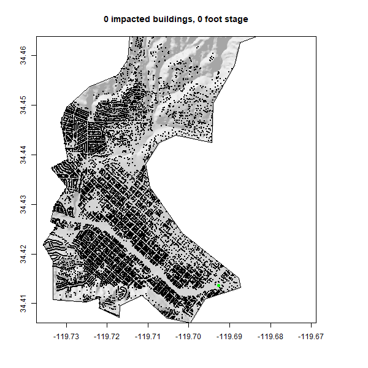

```{r setup, include=FALSE}
knitr::opts_chunk$set(warning = FALSE, message = FALSE, out.width = "75%", fig.align = 'center')
```

# Libraries
```{r, message=FALSE,warning=FALSE}
library(sf)        # vector manipulation
library(raster)    # raster manipulation
library(fasterize) # "faster" raster
library(whitebox)  # terrain analysis
```

### Data Manipulation

```{r}
library(osmdata)   # OSM API
library(elevatr)   # Elevation  Web Tiles
```


# Collecting the data needed for the analysis.
This includes representations of the elevation grid, the river network, and building structures.

# Basin boundary
```{r}

Basin = read_sf("https://labs.waterdata.usgs.gov/api/nldi/linked-data/nwissite/USGS-11119750/basin")

```


# Elevation Data
```{r,message=FALSE,warning=FALSE}

Elevation_Data = elevatr::get_elev_raster(Basin,13) %>% 
  crop(Basin) %>% 
  mask(Basin)

elevation_feet = Elevation_Data * 3.281

writeRaster(elevation_feet,"../data/elev_raster_feet.tif", overwrite = TRUE)
```
Overwrite is used to not get multiple copies after each run.


# Buildings and river-network data
```{r, message=FALSE,warning=FALSE}

Building = osmdata::add_osm_feature(opq(Basin),"building") %>% 
  osmdata_sf()
  
  
  
Stream = osmdata::add_osm_feature(opq(Basin),"waterway","stream") %>% osmdata_sf()


Centroid = st_centroid(Building$osm_polygons) %>% 
  st_intersection(Basin) 


Railroad = dplyr::filter(Centroid, amenity=="railway")


Rivers = st_intersection(Stream$osm_lines,Basin) 

```


# Terrain Analysis

### For Hillshade
```{r,message=FALSE,warning=FALSE, eval=FALSE}

wbt_hillshade("../data/elev_raster_feet.tif", "../data/terrian-near-flood-hillshade.tif")
```

```{r,message=FALSE,warning=FALSE}
Hillshade = raster("../data/terrian-near-flood-hillshade.tif")

plot(Hillshade, col= gray.colors(256, alpha = .5), legend=FALSE)
plot(Basin$geometry,add=TRUE)
plot(Rivers$geometry,add=TRUE)
```
Had to read in raster using `raster`

### Height Above Nearest Drainage
##### Creating the river raster
```{r,message=FALSE,warning=FALSE}

River = st_transform(Rivers,5070) %>% 
  st_buffer(10) %>%
  st_transform(crs(elevation_feet)) %>% 
  fasterize::fasterize(elevation_feet) %>% 
  writeRaster("../data/River.tif", overwrite=TRUE) #Saved raster

```

##### Creating the hydrologically corrected surface
```{r,message=FALSE,warning=FALSE, eval=FALSE}

wbt_breach_depressions("../data/elev_raster_feet.tif", "../data/breach_depressions.tif")

```

##### Creating the HAND raster
```{r,message=FALSE,warning=FALSE, eval=FALSE}

wbt_elevation_above_stream("../data/breach_depressions.tif","../data/River.tif", "../data/Elevation_above_stream.tif")

```

# Correcting to local reference datum
```{r,message=FALSE,warning=FALSE}
Hand_raster = raster("../data/Elevation_above_stream.tif")+3.69
```

Read in raster for HAND & add the offset (3.69) to the entire HAND raster

```{r}
River_raster = raster("../data/River.tif")
```

read in raster for River

```{r}
Hand_raster[River_raster == 1] = 0
```

Ensured that if the cell has a value of 1 in the river raster then its HAND value is set to 0.

```{r}
writeRaster(Hand_raster,"../data/Corrected_tif.tif", overwrite=TRUE)
```

Saved the new, offset raster to data folder


# 2017 Impact Assessment
### Map the flood & Estimate the impacts

```{r,message=FALSE,warning=FALSE}
Flood2017 = raster("../data/Corrected_tif.tif")
Flood2017_map = Flood2017
```

Read in the corrected HAND raster

```{r}
Flood2017_map[Flood2017_map >= 10.02] = NA
```

Created a flood map where any cell with a HAND value greater then 10.02 is set to NA.

```{r}
cols = ifelse(!is.na(raster::extract(Flood2017_map, Centroid)), "red", "black")
```

Colored impacted buildings

##### Created resulting map with the following plots
 - Plotted my hillshade, this time with a title using `main` and inputted data into your title with `paste0`.

 - Plotted flood map and building shapes with their geometries

 - Plotted the railway station as a point of reference colored in green, with cex = 1, pch = 16, and added the basin outline.
 
```{r}
plot(Hillshade, col= gray.colors(256, alpha = .5), legend=FALSE, main = paste0(sum(cols == "red"), " impacted buildings, 10.02 foot stage"))
plot(Flood2017_map, col= rev(blues9), legend=FALSE, add=TRUE)
plot(Centroid$geometry, add = TRUE, col = cols, pch = 16, cex=.08)
plot(Railroad$geometry, col= "green", cex=1, pch=16, add = TRUE)
plot(Basin$geometry, add = TRUE, border = "black")
```

### Does that map look accurate?
 - Yes, it does.

# Extra Credit
### Flood Inudation Map library
```{r,message=FALSE,warning=FALSE,eval=FALSE}
sb = AOI::aoi_get("Santa Barbara")
gif_flood = crop(Flood2017, sb) # cropping by comparing raster to vector
basin_clip = st_intersection(Basin, sb) # cropping by comparing vector to vector
hill_crop = crop(Hillshade, sb)
```

### Gif Creation

```{r,message=FALSE,warning=FALSE, eval=FALSE}
gifski::save_gif({
  for(i in 0:20) {
    tmp = gif_flood
    tmp[tmp >= i] = NA
    cols = ifelse(!is.na(raster::extract(tmp, Centroid)), "red", "black")
    plot(hill_crop, col= gray.colors(256, alpha = .5), legend=FALSE, main = paste0(sum(cols == "red"), " impacted buildings, ", i, " foot stage"))
    plot(tmp, col= rev(blues9), legend=FALSE, add=TRUE)
    plot(Centroid$geometry, add = TRUE, col = cols, pch = 16, cex=.08)
    plot(Railroad$geometry, col= "green", cex=1, pch=16, add = TRUE)
    plot(basin_clip$geometry, add = TRUE, border = "black")
  }
}, gif_file = "../data/mission-creek-fim.gif",
   width = 600, height = 600, 
   delay = .7, loop = TRUE)
```


### Why at 0 stage, are we capturing impacted buildings?
Because certain buildings on this map are so close to the river, remote sensing itslef isn't at the ability yet to capture this small of a difference between these specific buildings and the rivers nearby and because of this, Rstudios is also not able to then show this as well.
